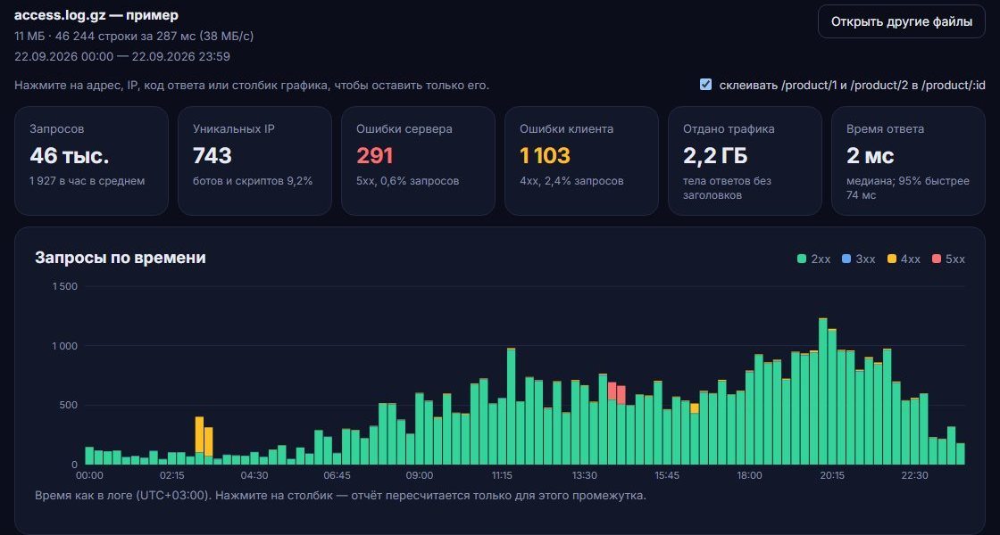
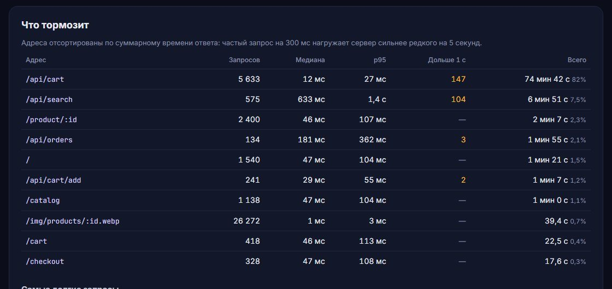

# Читалка логов nginx

Страница, которая разбирает access.log nginx прямо в браузере. Открываете файл и видите, какие адреса падают, что тормозит, кто сканирует сайт в поисках /wp-login.php и /.env и какая доля трафика приходится на ботов.

**Демо: [fedorov-n.ru/logscope](https://fedorov-n.ru/logscope/)**. Там есть пример: сутки выдуманного интернет-магазина со сбоем в 14:20, ночным сканером, медленным поиском и битой ссылкой из Telegram-канала.

Лог не покидает компьютер. Файл читается по частям в фоновом потоке (Web Worker), на сервер ничего не отправляется. Ставить ничего не нужно: это удобно, когда лог скачан с сервера, а поднимать ради него GoAccess или ELK не хочется.



## Что показывает

- Сводку: запросы, уникальные IP, ошибки 4xx и 5xx, трафик, медиану и 95-й перцентиль времени ответа.
- График запросов по времени с разбивкой на 2xx, 3xx, 4xx и 5xx. Шаг выбирается сам, от минуты до недели.
- Топ адресов и IP. Адреса вида `/product/1042` склеиваются в `/product/:id`, иначе топ забит тысячей строк по одному запросу. Склейку можно выключить.
- Ошибки 5xx по адресам и 404 без сканеров, то есть свои битые ссылки и пропавшие файлы.
- **Что тормозит**: адреса по суммарному времени ответа, медиана, p95, сколько запросов шли дольше секунды, и самые долгие запросы поштучно.
- **Сканеры уязвимостей**: IP, которые перебирали чужие админки и файлы с паролями, с временем и примерами путей.
- Ботов и браузеры по User-Agent и сайты, с которых приходят. Переходы между страницами самого сайта отбрасываются: свой домен определяется по referer у картинок и скриптов.

Клик по адресу, IP, коду ответа или столбику графика пересчитывает весь отчёт только для него. Можно, например, выбрать столбик со сбоем и посмотреть, какие адреса падали и у кого.



## Какие логи подходят

- Стандартный `combined`, который nginx пишет по умолчанию. Формат Apache такой же.
- `combined` с полями в конце: `$request_time`, `rt=0.042 uct=… urt=…`, X-Forwarded-For в кавычках. Время ответа берётся из хвоста строки.
- JSON-логи (`log_format … escape=json`) с привычными полями: `remote_addr`, `time_iso8601` или `time_local`, `request` или `request_method` + `uri`, `status`, `body_bytes_sent`, `request_time`.
- `.gz` распаковывается на лету, gzip узнаётся по первым байтам файла. Можно выбрать сразу несколько файлов, например `access.log`, `access.log.1`, `access.log.2.gz`: получится один отчёт.

Чтобы видеть время ответа, в формат лога нужно добавить `$request_time`:

```nginx
log_format timed '$remote_addr - $remote_user [$time_local] "$request" '
                 '$status $body_bytes_sent "$http_referer" "$http_user_agent" $request_time';
access_log /var/log/nginx/access.log timed;
```

## Скорость и память

Замер на примере, повторённом 20 раз: 232 МБ, 925 тысяч строк.

| | Время | Скорость |
|---|---|---|
| Node 24, текст (`npm run bench`) | 3,2 с | 73 МБ/с, ~290 тыс. строк/с |
| Node 24, тот же лог в gzip | 4,1 с | 57 МБ/с |
| Chrome, страница демо | 3,4 с | 65 МБ/с |

Гигабайтный лог читается примерно за 15 секунд. Памяти уходит около 11 МБ на счётчики, сколько бы строк ни было, потому что лог целиком в память не загружается. Таблицы адресов и IP ограничены 50 тысячами ключей; при переполнении выбрасываются самые редкие, в топ они всё равно не попали бы.

Откуда скорость:

- Повторяющиеся строки не разбираются заново. Определение бота по User-Agent, склейка адреса и домен referer запоминаются в небольшом кэше. Профилировщик показал, что без кэша на них уходила треть времени, а с ним скорость выросла с 44 до 73 МБ/с.
- Время `22/Sep/2026:14:05:09 +0300` разбирается вручную, без `Date.parse`. Последний ответ запоминается: у соседних строк обычно одна и та же секунда.
- Перцентили считаются по гистограмме с логарифмическими корзинами шириной 10% с интерполяцией внутри корзины. Список всех времён ответа не хранится. Погрешность в тестах меньше 5%, а результат зажат между минимумом и максимумом, реально встреченными в логе.

## Как проверено

`npm test` использует встроенный в Node тест-раннер. Тесты проверяют:

- разбор форматов: combined, common, хвост с `rt=`, X-Forwarded-For, JSON, TLS-рукопожатие на 80-й порт, прокси-запросы с полным адресом;
- время с разными часовыми поясами;
- склейку адресов и определение ботов;
- точность перцентилей;
- чтение нескольких файлов, gzip, CRLF и последней строки без перевода строки.

Главный тест разбирает пример и проверяет, что всё спрятанное в нём находится: все 5xx попадают в окно сбоя 14:20–14:38, оба сканера найдены, битая ссылка стоит в первой двойке 404, поиск оказывается среди медленных адресов.

Пример генерирует `scripts/make-sample.ts` с фиксированным зерном случайности. Все IP в нём взяты из диапазонов для документации (RFC 5737 и RFC 3849), домен `samovar.example` зарезервирован.

```
npm ci
npm test
npm run dev          # страница на localhost
npm run bench -- 20  # замер: пример × 20 в памяти, добавьте --gz для gzip
npm run sample       # пересобрать пример
```

## Лицензия

MIT
